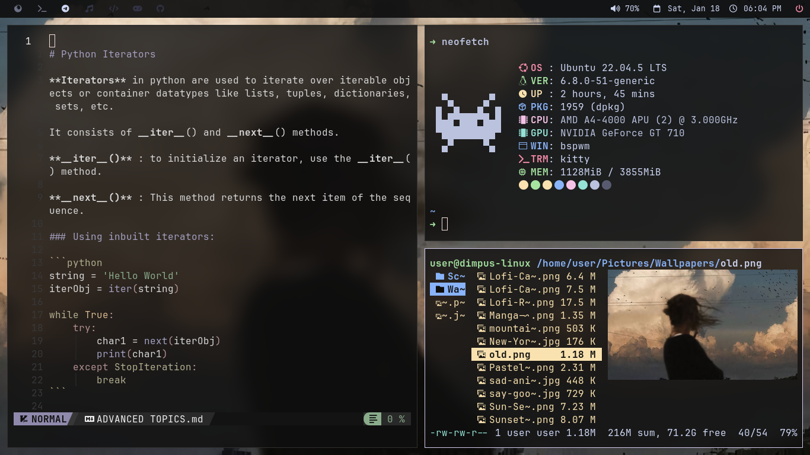

Welcome to my personal dotfiles repository! This setup is designed to create a clean and efficient workflow with the following tools:

- **Window Manager**: BSPWM
- **Compositor**: Picom
- **File Manager**: Thunar/Ranger
- **Application Launcher**: Rofi
- **Top Bar**: Polybar
- **Terminal**: Kitty

---

## 📸 Screenshots





---

## ➕Dipendencies

- **Jet Brains Mono Nerd Font**
- **Kitty Terminal**
- **Rofi**
- **Polybar**

---

## 🗂️ Directory Structure

```plaintext
dotfiles/
├── bspwm/               # BSPWM configuration files
├── picom/               # Picom configuration
├── polybar/             # Polybar settings and modules
├── rofi/                # Rofi configuration and themes
│   └── themes/          # Custom Rofi themes
├── sxhkd/               # SXHKD keybindings
├── neofetch/            # Neofetch settings for system info
└── kitty/               # Kitty terminal configuration
```

## 🛠️ Installation Instructions
-----------------------------

### Step 1: Clone the Repository

Start by cloning the repository to your home directory (or wherever you prefer):

```bash
git clone https://github.com/yourusername/dotfiles.git
cd dotfiles
```
### Step 2: Manually Move Configuration Files

Move each configuration folder into ~/.config:

```bash
mv bspwm ~/.config/
mv picom ~/.config/
mv polybar ~/.config/
mv rofi ~/.config/
mv sxhkd ~/.config/
mv neofetch ~/.config/
mv kitty ~/.config/
```

### Step 3: Move Rofi Themes


#### Move the themes folder
```bash
mv rofi/themes/* ~/.local/share/rofi/themes/
```
 
