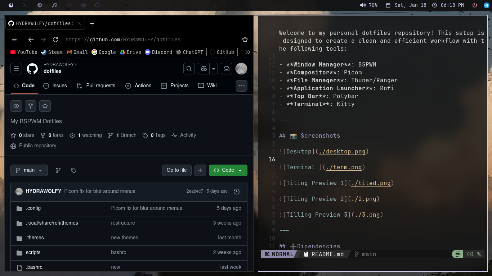

Welcome to my personal dotfiles repository! This setup is designed to create a clean and efficient workflow with the following tools:

- **Window Manager**: BSPWM
- **Compositor**: Picom
- **File Manager**: Thunar/Ranger
- **Application Launcher**: Rofi
- **Top Bar**: Polybar
- **Terminal**: Kitty

---

## 📸 Screenshots

---

## ➕Dipendencies                       

- **Jet Brains Mono Nerd Font**
- **Kitty Terminal**
- **Rofi**
- **Polybar**

---

