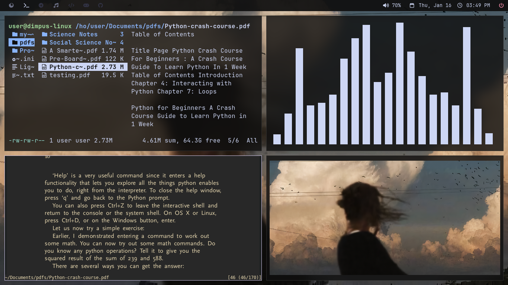

Welcome to my personal dotfiles repository! This setup is designed to go hand in hand with my workflow needs,with the following tools:

- **Window Manager**: BSPWM
- **Compositor**: Picom
- **File Manager**: Thunar/Ranger
- **Application Launcher**: Rofi
- **Text Editor:** Neovim(Mountain Theme)
- **Top Bar**: Polybar
- **Terminal**: Kitty(Modified Catppuccin Mocha Theme)
- **PDF Reader**: Zathura(Gruvbox Theme)
- **Notification Daemon**: none(I don't use one cause i don't need one.)
- **Fetch Application**: Neofetch
- **Music Player**: Cmus(Catppuccin Theme)

---

## Screenshots





---

## Prerequisites

- **BSPWM**
- **Jet Brains Mono Nerd Font**
- **Kitty Terminal**
- **Rofi**
- **Polybar**
- **Picom**
---
## Installation
- Clone the git repository,```git clone https://github.com/HYDRAWOLFY/dotfiles.git```
- Copy the files inside the ```.config``` directory to your system's ```~/.config``` directory
- Move the files located in ```.local/share/rofi``` to your systems ```~/.local/share/``` directory.

--- 
